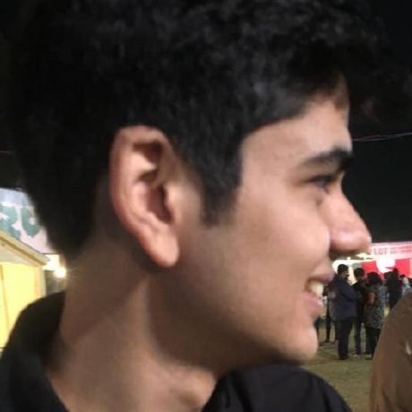

## About Me

 

Hi! I am Ahsan. I am a fourth year student at Birla Institute of Technology and Science (BITS), Pilani, majoring in Computer Science. I will be joining Microsoft as a Software Engineering Intern in the summer of 2021.  

I am broadly interested in Natural Language Processing and Machine Reading Comprehension tasks. I also like to solve Competitive Programming questions.

Currently, I am interning under [Dr. Goran Nenadic](https://www.research.manchester.ac.uk/portal/gnenadic.html) at The University of Manchester, working on Natural Text Generation and reasoning skills of MRC models for better generalizability on clinical reports.

I most recently got the Future Research Talent Award of $6000AUD by Australian National University to work at the [Clear Vision Research Group](https://www.clearvisionresearch.com/) under [Dr. Riccardo Natoli](https://jcsmr.anu.edu.au/people/academics/dr-riccardo-natoli) 
(Postponed due to COVID19)

I worked on making a mobile application for Cervical Cancer diagnosis and an object detection model for low-cost Colposcopic examinations at the Machine Vision Laboratory, CEERI-Pilani under [Dr. J L Raheja](https://www.ceeri.res.in/profiles/j-l-raheja/). 
 
I interned at [Institute of Genomics and Integrative Biology](https://www.igib.res.in/) after my second year, a research centre of [Council of Scientific and Industrial Research](https://www.csir.res.in/), where I worked on a implementing an entropy based distance metric between indiviuals for their phenotypic profiles. I also worked on zebrafish videos to create a bounding box for their heart and plot variations to estimate their heartbeat.

---

## Recommendations 

(Books-Tutorials-Articles-Podcasts)
TBA

---
